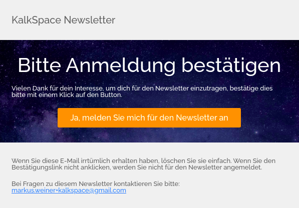

HTML Email-Templates

# HTML Email-Templates
## Templates für:

* Anmeldung
* Bestätigungsmail
* Reminder
* Settings
* Unsubscribe

What does each Template have in common?
Subject, Sender, Title

## Anmeldung

### Dateiname Template:
SubscribeMail.mjml
HTML-Template:
SubscribeMail.html

Newsletter Anmeldung:

Eigenschaften:

Mailto-Link führt zu einer E-Betreff "Newsletter Anmeldung"
Mail an "markus.weiner+kalkspace@gmail.com" mit Betreff "Newsletter Anmeldung"

Hintergrundbild im Header wurde von Kalkspace-Webseite genommen:
https://kalk.space/img/space.jpg
{{Subject}}
{{MailToSubject}}
